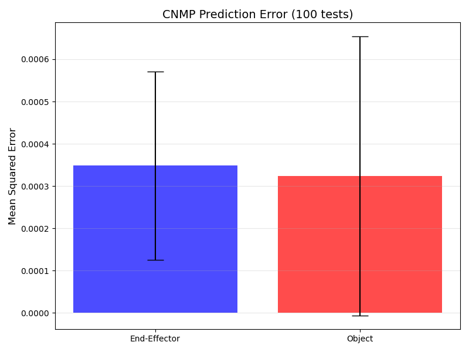

# Assignment 3: Learning from Demonstration with CNMP

In this assignment, the robot was trained using the CNMP architecture. Below, the mean squared error of the object and the end-effector are plotted.

